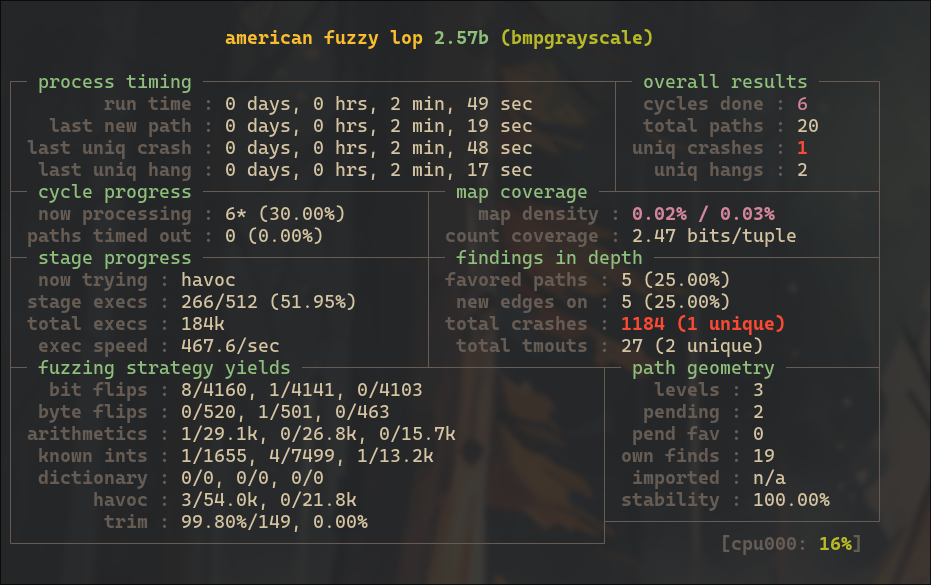
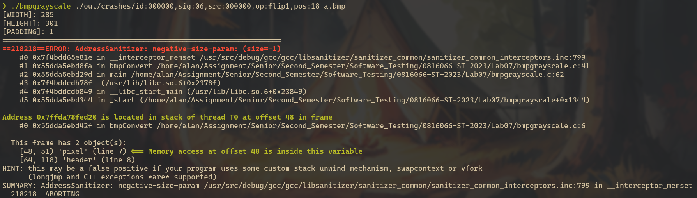

# Lab07 Report
## PoC
The file that caused the crash is placed at `./assets/id:000000,sig:06,src:000000,op:flip1,pos:18`.

## Steps
1. Compile the source code.
    ```sh
    $ export CC=afl-gcc
    $ export AFL_USE_ASAN=1
    $ make
    ```

3. Create a directory `in/` and copy `test.bmp` into it.
    ```sh
    $ mkdir in/
    $ cp ./test.bmp in/
    ```

2. Run AFL
    ```sh
    $ afl-fuzz -i in/ -o out/ -m none -- ./bmpgrayscale @@ a.bmp
    ```

## Screenshots
### Running AFL:


### A Crash Detail:

